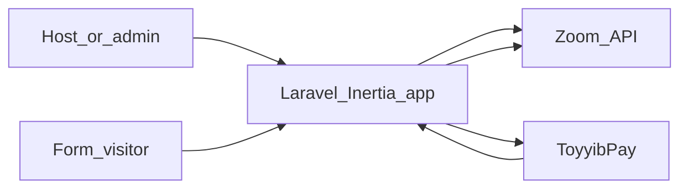

# Article scaffold: what this project is

Use this file as the **source draft** for Medium and your own blog. Replace sections marked `<!-- EDIT -->` with your personal story, numbers, and links.

---

## Suggested titles (pick or merge)

- **From Jotform bills to our own stack: how we run paid Zoom registrations**
- **Replacing a form SaaS: Zoom meetings, registrations, and payments in one app**
- **What we built instead of Jotform + glue: Laravel, React, and Zoom**

---

## Lede (2–3 sentences)

<!-- EDIT: Replace the bracketed bits with your voice. -->

I **[role / context—e.g. run live cohorts, train teams, host paid webinars]** and for a long time I paid for **Jotform** mostly so people could **register for Zoom meetings** without me doing it by hand. That subscription bought convenience, but it also bought **another vendor**, **another export**, and **limited control** over how registration and payment fit together. This project is our **in-house web app**: **Laravel** and **React** on the server and browser, **Zoom OAuth** for meetings and registrants, and **ToyyibPay** when a form should be paid—**one product surface**, **our data**.

---

## What this project is (factual backbone)

This repository is a **web application** where signed-in users can connect **Zoom** via **OAuth**, manage **Zoom meetings**, and build **public forms** (component-based forms in the UI). Form submissions can drive **Zoom meeting registration**; paid flows use **ToyyibPay** with a **per-form payment category**. In plain terms, it is a **first-party alternative** to chaining a form SaaS like Jotform with Zoom and a payment provider—you **own the UX, integrations, and stored submissions**.

High-level flow for readers:



---

## Technology stack (article-ready)

`composer.json` in this repo requires **Laravel 11+** (`laravel/framework: ^13.0`). The project README still describes “Laravel 12” in places—**for publication, quote `composer.json` or run `php artisan --version` on your deployed build** so the version line matches reality.

| Layer | Technology | Role in this project |
|--------|-------------|----------------------|
| Backend | Laravel | HTTP, auth, business logic, queues, integrations |
| Frontend | React + TypeScript | Dashboards and public forms |
| Full-stack bridge | Inertia.js | SPA-like navigation without hand-rolling a JSON API for every screen |
| Styling | Tailwind CSS v4 | Layout and design system |
| Build | Vite | Bundling and dev server |
| Dev environment | Laravel Sail (Docker) | Consistent PHP, Node, DB, Redis locally |
| Database | PostgreSQL | Application data |
| Cache / queues | Redis + Laravel Horizon | Jobs and queue visibility |
| Realtime (where used) | Laravel Reverb + Echo | Websockets |
| Auth | Laravel Fortify + app UI | Authentication flows |
| Permissions | Spatie Laravel Permission | Roles and abilities |
| Observability | Laravel Telescope, Nightwatch (as configured) | Debugging and monitoring in appropriate environments |
| Quality | Pest, PHPStan/Larastan, Rector, Pint, ESLint, Prettier | Tests and consistency |
| Zoom | OAuth 2.0 + Zoom REST API (scopes documented in `README.md`) | Accounts, meetings, registrants |
| Payments | **ToyyibPay** | Paid submissions; category per form |

**One-liner for a mixed audience:** Under the hood it is a **Laravel monolith** with a **React** front end through **Inertia**; attendees mostly see **a form** and, when relevant, **a payment step** and **a Zoom join path**.

---

## The Jotform angle (story beats—add your specifics)

<!-- EDIT: Insert real numbers (monthly cost, hours lost) where you can. -->

1. **Cost and dependency:** Jotform was justified mainly by **Zoom registration**, not by “forms in general.”
2. **Friction:** Describe what hurt—**branding**, **workflow limits**, **exports**, **support**, **pricing tier**, or **compliance**—in your own words.
3. **Decision:** Build in-house (solo, team, or with help) vs. stay on SaaS—**what tipped the scale**.
4. **Outcome:** **Forms + Zoom + ToyyibPay** in one place, aligned with how you run **events, courses, or paid sessions**.

---

## Time to produce the article (writing and editing only)

| Deliverable | Time (solo, experienced writer) |
|-------------|--------------------------------|
| **Tight Medium post** (~900–1,400 words), one hero image, light stack mention | **2–4 hours** |
| **Longer blog version** (~2,000–3,000 words), diagrams, developer sidebar | **5–8 hours** over 1–2 days |
| **Dual publish** (Medium + own blog), canonical URL, different intros | **+1–2 hours** |

Add **1–3 hours** if you are capturing **screenshots** and doing a **technical accuracy pass** against a running environment.

---

## Medium vs. your blog

- **Medium:** Front-load the promise in the **first ~100 words**; simplify the stack table to **bullets**; one **CTA** (site, waitlist, or contact).
- **Own blog:** Use as **canonical** home for SEO if you care more about search than Medium distribution; you can keep **Mermaid** and longer tables here.

---

## Canonical URL and cross-posting (choose one home)

**Pick exactly one canonical URL** for each article so search engines do not treat two full copies as duplicate content.

| If canonical is… | Do this on the *other* property |
|------------------|----------------------------------|
| **Your blog** (`https://yourdomain.com/...`) | On Medium: use **“Import story”** *or* publish a **short teaser** (2–3 paragraphs) with a **single prominent link** to the canonical post. Prefer Medium’s import when available—it sets canonical to your source. |
| **Medium** | On your blog: publish a **summary or excerpt** (150–300 words) + `link rel="canonical"` pointing to the Medium URL **or** use a **301 redirect** from your slug to Medium (less common). |

**Blog HTML (canonical points to Medium—example only):**

```html
<link rel="canonical" href="https://medium.com/@youruser/your-story" />
```

**Blog HTML (canonical is your blog—preferred when you own SEO):**

```html
<link rel="canonical" href="https://yourdomain.com/articles/paid-zoom-registrations" />
```

**Medium-only note:** If you paste the full article twice with no canonical strategy, expect **split signals** for ranking; for brand and clarity, **one full version** + **one teaser or import** is cleaner.

---

## Screenshot capture runbook

Use **staging** or **local** with fake data. **Blur or crop** PII (emails, names, meeting IDs) before export.

| # | Screen | What it proves | Suggested filename |
|---|--------|------------------|---------------------|
| 1 | Signed-in **Zoom connect** or OAuth success | You integrate Zoom properly | `article-01-zoom-connected.png` |
| 2 | **Meetings list** or meeting detail | Meetings are first-class in the app | `article-02-meetings.png` |
| 3 | **Form builder** (components visible) | Jotform-class “build a form” story | `article-03-form-builder.png` |
| 4 | **Public form** (slug URL, no auth) | Attendee-facing experience | `article-04-public-form.png` |
| 5 | **ToyyibPay** redirect or return (or settings mentioning ToyyibPay) | Paid path is real | `article-05-payment.png` |

**Anonymization:** Use test Zoom accounts, toy emails (`test+...@`), and non-production ToyyibPay sandboxes or low-value test categories if your provider allows it.

---

## Checklist before you publish

- [ ] **Public product name** and URL (if you are linking out)
- [ ] **Screenshots** from the runbook above
- [ ] **Privacy:** What you store (submissions, OAuth tokens, emails, IP logs)—keep it honest and link to a policy if you have one
- [ ] **Disclaimer:** “This was our situation; pricing and features for Jotform and ToyyibPay change.”
- [ ] **Canonical URL** chosen and set (see section above)

---

## Preferences locked for this draft (from your planning session)

- **Payments in the article:** **ToyyibPay** (matches this codebase—not Stripe).
- **Primary reader:** **Mixed** technical and business.

---

## AI style note (paste into a new agent chat to elaborate)

Copy from `BEGIN_STYLE_NOTE` to `END_STYLE_NOTE`. Replace every `<!-- ... -->` inside that block with your own samples and bullets.

```text
BEGIN_STYLE_NOTE

You are expanding my article draft. Audience: mixed technical and business readers.

Voice and style:
- Paste 2–3 paragraphs of my past writing here (blog, newsletter, or LinkedIn) so you can match rhythm and vocabulary:
  <!-- PASTE YOUR WRITING SAMPLES -->
- Tone: <!-- e.g. direct, warm, witty, formal -->
- Sentence length: <!-- e.g. short opener sentences + occasional long explainer -->
- Avoid: <!-- e.g. hype adjectives, emojis, first-person plural -->

Facts you must preserve (do not invent):
- This app replaces a workflow where I used Jotform mainly for Zoom meeting registration.
- Payments in the product are via ToyyibPay (not Stripe).
- Stack summary: Laravel, Inertia, React, TypeScript, Tailwind v4, Vite, PostgreSQL, Redis and Horizon, Zoom OAuth, Fortify, Spatie Permission; Sail for local dev.

Your task:
1. Turn my bullet outline into a flowing article.
2. Keep a short "for builders" section (stack + why monolith/Inertia) and a short "for organizers" section (user-visible benefits).
3. Suggest a Medium subtitle and 3 pull quotes (one sentence each) I might use as graphics.
4. Do not claim performance, security, or revenue numbers I did not provide.

My outline and rough notes:
<!-- PASTE OUTLINE OR THIS FILE'S SECTIONS YOU WANT EXPANDED -->

END_STYLE_NOTE
```

### After the AI returns a draft

1. **Read aloud** once—cut repetition.
2. **Strip any invented metrics** the model added.
3. **Medium:** tighten intro; **blog:** restore tables or appendix if you want.

---

## Optional outline bullets (paste into the AI block)

- Problem: Jotform subscription mostly for Zoom signup; glue and limits.
- Solution: One app—forms, Zoom OAuth, registrants, ToyyibPay per form.
- For organizers: fewer tabs, clearer attendee path, owned data.
- For builders: Laravel + Inertia + React; Horizon/Reverb/Telescope as infra; tests with Pest.
- Honest tradeoffs: you maintain hosting, upgrades, and Zoom API changes.
- Close: CTA + what you learned.
