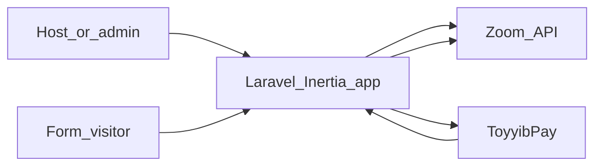
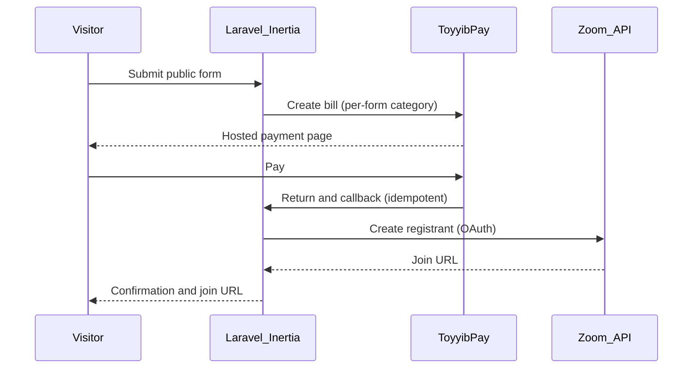

For a long time I paid for **Jotform** mostly so people could register for **Zoom** meetings without me doing it by hand. That subscription bought convenience, but it also bought another vendor, another export, and limited control over how registration and payment fit together. The bill was never the whole story—the real cost was the glue: spreadsheets, manual checks, and a UX that never quite matched how I actually run sessions.

This post is about what I built instead: an in-house web app where **Laravel** and **React** own the server and browser, **Zoom OAuth** owns meetings and registrants, and **ToyyibPay** handles money when a form should be paid. One product surface, our data, and a design that treats integrations as first-class—not as afterthoughts bolted onto a generic form builder.

This assumes you have shipped at least one Laravel app to production and you are comfortable reading a sequence diagram. You do not need my exact business numbers to get value from the architecture choices.

## When the subscription becomes an architecture brief

Build-versus-buy is easy to caricature. In practice, the decision is rarely "we hate SaaS" or "we love building things." It is a boundary question: *which seams do you want to own?*

A form SaaS is an excellent fit when your problem is "collect arbitrary fields and store them." It stops being a neat fit when your problem is "take money, prove payment, create a Zoom registrant, handle failures, and still sleep at night." At that point you are not buying forms—you are buying a hosting platform for your integration diagram, with someone else's rate limits, branding, and data model in the middle.

I did not set out to replace "forms in general." I set out to replace a workflow where **Jotform** was justified mainly by **Zoom registration**, with payment tacked on as a second hop. Once I said that out loud, the architecture brief wrote itself: own the attendee journey end-to-end, keep the host experience in one app, and stop exporting truth from one system into another.

There is a useful distinction here that I lean on when I wear a solution architect hat. **Commodity capability**—generic CRUD, auth basics, email delivery—is often cheaper to rent than to run. **Differentiating workflow**—the exact order of payment, identity, and meeting admission for your events—is often cheaper to own when it changes often and when mistakes are expensive. The mistake is renting the second thing because it came bundled with the first.

## What I actually built

This repository is a **web application** where signed-in users connect **Zoom** via **OAuth**, manage **Zoom meetings**, and build **public forms** using a component-based form builder in the UI. Form submissions can drive **Zoom meeting registration**; paid flows use **ToyyibPay** with a **per-form payment category**. In plain terms, it is a first-party alternative to chaining a form SaaS with Zoom and a payment provider—you own the UX, the integrations, and the stored submissions.

High-level flow:

Under the hood it is a **Laravel** monolith with a **React** front end through **Inertia.js**; attendees mostly see a form and, when relevant, a payment step and a Zoom join path. That sentence is doing more work than it looks—it encodes a deliberate choice about where complexity lives.

### Technology stack at a glance

If you are skimming for credibility, here is the spine I standardised on—boring names, predictable operations:

- **Backend:** **Laravel** for HTTP, auth, business logic, queues, and integrations.
- **Frontend:** **React** with **TypeScript** for dashboards and the public form experience.
- **Full-stack bridge:** **Inertia.js** so I get SPA-like navigation without treating every screen as a bespoke JSON contract.
- **Styling and build:** **Tailwind CSS** v4 and **Vite**—fast feedback in dev, small surprises in prod.
- **Data and async work:** **PostgreSQL** as the system of record; **Redis** with **Laravel Horizon** for queues and visibility.
- **Auth and permissions:** **Laravel Fortify** for authentication flows; **Spatie Laravel Permission** for roles and abilities.
- **Realtime (where it earns its keep):** **Laravel Reverb** with **Echo**—only where live updates materially help hosts.
- **Quality and static analysis:** **Pest**, **PHPStan** / **Larastan**, **Rector**, **Pint**, **ESLint**, and **Prettier** so refactors do not become archaeology.
- **Local consistency:** **Laravel Sail** so new contributors stop arguing about PHP extensions and start reproducing bugs.
- **Observability:** **Telescope** (in appropriate environments) and **Nightwatch** as configured—debugging tools belong behind the same judgement gate as any other dependency.

Before you quote a version number in your own article, run `php artisan --version` on the build you ship and align your README. Documentation drift is a tax you pay in reader trust.

## Why a Laravel monolith with Inertia—not a decoupled SPA

If you have shipped both styles, you know the trade-off table by heart. A separate SPA plus a JSON API gives you crisp boundaries on paper. In a small product with deep auth, payments, and third-party OAuth, it often gives you *more* seams: duplicate validation, session edge cases, CORS configuration that exists mostly to remind you HTTP was not designed for your convenience, and a second place for every bug to hide.

**Inertia** keeps server-side routing, policies, and session auth where Laravel already shines, while still letting **React** own rich UI for the form builder and dashboards. You are not hand-rolling a REST surface for every screen just to move JSON back and forth; you are shipping features. The server remains the place where I enforce invariants—"this host may attach this meeting," "this submission may transition to paid," "this Zoom token may call this scope"—without exposing half my rules to the browser as optional hints.

Would I force this shape on a large multi-team org building a public API product? No. For a focused internal-and-customer-facing app where the outward integrations are mostly **Zoom** and **ToyyibPay**, the monolith wins on speed of change and operational simplicity: one deploy unit, one observability story, one place to attach back-pressure when a queue backs up.

Where decoupling *does* make sense is when multiple clients need the same contract—mobile apps, partner integrations, a public API with versioning discipline. This app is not pretending to be that. If it grows into that, I would peel boundaries deliberately with usage evidence, not because microservices look tidy on a slide.

## The integration design

The interesting failures are never "the happy path." They are duplicate callbacks, stale OAuth tokens, and the user who paid but closed the tab before your server finished talking to Zoom.

The paid-registration flow needs to be **idempotent** at the boundaries: ToyyibPay can call you more than once, users can refresh, and networks can split mid-handshake. Your application should answer the same question safely: "Given this payment reference, have we already created the registrant and persisted the join artefact?"

I treat provider callbacks like network delivery: at-least-once is the realistic assumption. That pushes design toward **idempotency keys** or natural keys you can safely repeat—payment reference plus form submission identifier, not "increment a counter and hope." If the handler runs twice, the second run should observe the first run's effects and exit without creating duplicate registrants or sending duplicate confirmation emails.

Heavy work—calling **Zoom**, sending mail, generating PDFs if you add them—belongs behind a **queue** with explicit retry policy. The HTTP request that acknowledges ToyyibPay should be short: validate signature or shared secret, persist intent, dispatch work, return a crisp response. Coupling "acknowledge payment" to "complete every downstream side effect inline" is how you get timeouts that masquerade as unpaid customers.

Sequence at a high level:

**Zoom OAuth** is not "connect once and forget." Token refresh, scope changes, and revoked grants are operational facts. I treat the Zoom connection as state that must be observable and recoverable—hosts should see a clear failure mode, not a silent 401 buried in a queue job. Practically, that means logging with correlation identifiers, surfacing "reconnect Zoom" in the UI when refresh fails, and refusing to start paid flows when the integration is known-broken rather than failing halfway through someone's card charge.

**ToyyibPay** sits where **Stripe** often sits in write-ups from other regions; naming the provider matters because the failure modes and reconciliation habits are provider-shaped. Per-form payment categories keep accounting intent in the product model instead of in spreadsheet columns. If finance asks "which product line paid for this cohort," the answer should be queryable from your schema—not inferred from memo text in a gateway dashboard.

## Domain modelling: where state is allowed to live

The quickest way to paint yourself into a corner is to stuff `paid: true` on the submission row and call it a day. Payment is a process with a timeline—initiated, redirected, confirmed, disputed, refunded (if your rules allow). Zoom registration is another process that depends on confirmed payment and valid OAuth context.

I keep **Form**, **Submission**, **Payment** (or equivalent), and **Zoom registration outcome** as separate concerns with explicit links. That is not ceremony for its own sake; it is how you answer support questions without guessing which row is canonical. When someone emails "I paid but I have no link," you want a straight-line story: payment row state, job attempts in Horizon, Zoom API response persisted or error classified.

Forms as **components** in the UI map cleanly to structured data: you can validate server-side against the same schema the builder emitted, and you can evolve field types without migrating a vendor's idea of a "form." The builder is not the source of truth—the persisted definition is—so you can render historical submissions faithfully even if the builder UI changes next week.

Transactions matter at the right grain. I am cautious about holding database transactions open across HTTP calls to Zoom or ToyyibPay; the pattern that scales emotionally is: write intent locally, commit, call providers, record outcomes, compensate if needed. "All-or-nothing" across three organisations is a fantasy; **sagas** in the small—retry, dead-letter, manual reconcile—are the honest implementation.

## Operations and observability

The stack is boring on purpose—**PostgreSQL** for truth, **Redis** and **Horizon** for queues, **Telescope** where it belongs (not in production as a default), **Pest** and **PHPStan** / **Larastan** as gates, **Pint** and **Prettier** so style arguments die quietly.

**Laravel Reverb** and **Echo** earn their keep only where realtime actually improves the host experience; otherwise they are another moving part. As a solution architect reflex: every websocket is a future incident—open it when the user story demands it, not when the stack looks impressive in a diagram.

Runbooks beat heroics. I want a new teammate—or future me at 2 a.m.—to find: which queue handles Zoom registration, which log fields identify a submission, how to replay a failed job safely, and what "done" looks like in Horizon for each stage. If that documentation lives only in your head, you have not finished the system; you have merely shipped a binary.

## What I now own (honest trade-offs)

Self-hosting means I own upgrades, backups, and Zoom API churn. ToyyibPay and Zoom can both change behaviour; I need a maintenance mindset, not a "we shipped v1" mindset.

Refunds, partial attendance, and "I paid twice" edge cases do not disappear because you left SaaS—they land in *your* support channel with *your* logs. That is the fair price for owning the seam. Compliance and privacy move in-house too: what you store (submissions, OAuth tokens, emails, IP logs) needs a straight answer you can paste into a policy without squinting.

## When I would still pay for the SaaS

If my problem were genuinely generic forms—internal surveys, one-off quizzes, no money, no OAuth to third parties—I would buy the tool and move on. The replacement project made sense because the integration surface was the product, not the form fields.

If the monthly line item is cheaper than the on-call and opportunity cost of building and maintaining integrations, the spreadsheet still says "buy." Architecture is not a moral contest; it is a risk-adjusted decision.

## Takeaway

If you are teetering on the same decision, start by naming the job your SaaS is *actually* doing. If the answer is "host my integration between money and Zoom," you might be under-buying convenience and over-buying someone else's generic model. If the answer is "collect data," keep the subscription and spend your engineering time elsewhere.

If you do build, optimise for **observable seams** and **idempotent boundaries** first. Fancy UI comes after you can explain—using logs alone—why a specific attendee did or did not get a join link.

---

*If you are building something similar: quote your real `composer.json` and deployed versions in any public write-up—README drift has embarrassed better teams than mine.*
